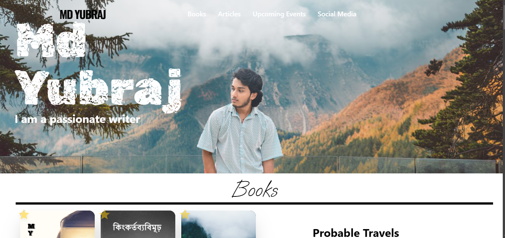

# MD Yubraj - Travel Portfolio Website 🌍

This is a portfolio website for **MD Yubraj**, a passionate traveler. The website showcases his travel experiences, books, and probable upcoming journeys.



## 🛠️ Tech Stack

- **React** (Plain React with Functional Components)
- **TypeScript** (For type safety)
- **Tailwind CSS** (For styling)

## 🚀 Features

- Clean **landing page** with a modern UI
- Section for **Books** with pricing details
- **Probable Travel Destinations**
- **Viewer Count** and social interactions
- Articles on travel experiences with **like & share** functionality

## 📦 Installation & Setup

1. Clone the repository:

   ```sh
   git clone https://github.com/your-username/md-yubraj-portfolio.git
   cd md-yubraj-portfolio
   ```

2. Install dependencies:
   ```sh
   npm install
   ```
3. Start the development server:
   ```sh
   npm run dev
   ```

## 🎯 Deployment

The site is hosted on **GitHub Pages**. To deploy:

```sh
npm run build
npx gh-pages -d dist
```

## 📌 Live Demo

🔗 [View the website](https://mdyubraj.com/)

## 📧 Contact

If you have any questions or want a similar website, feel free to reach out!

---

⭐ Developed by [Yeasin Arafat](https://github.com/yeasinarafat1)
